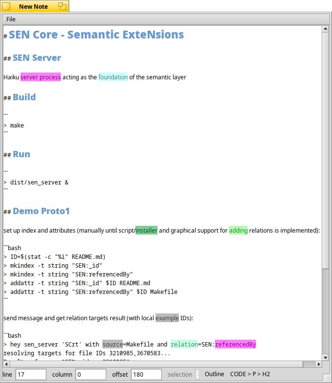

  

# SENity

a minimalistic semantic editor for your thoughts

# Dependencies and Thanks

This editor uses a slightly [MD4C](https://github.com/mity/md4c) library for parsing Markdown text on demand.

# Current State

Heavily in progress, prototype stage.

Here's a screenshot from the current state, to be updated regularly:

  

