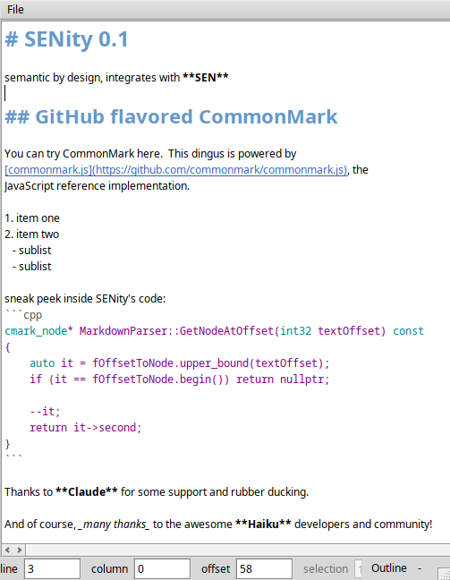

  

# SENity

a minimalistic semantic editor for your thoughts

# Dependencies and Thanks

* for Markdown parsing, this editor uses the excellent [cmark-ghm](https://github.com/github/cmark-gfm) library.

# Current State

Heavily in progress, prototype stage.

Here's a screenshot from the current state, to be updated regularly:

  

